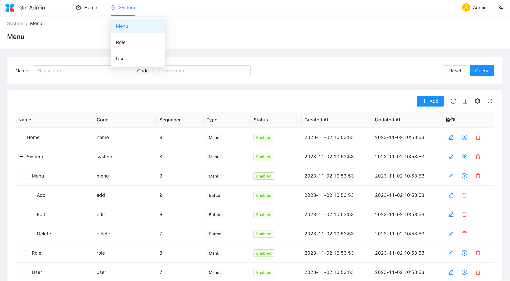

# GIN-Admin-Frontend

> GIN-Admin-Frontend is a frontend project for [gin-admin](https://github.com/LyricTian/gin-admin) base on Ant Design React.



- [Preview](http://101.42.232.163:8040)
  - Username: admin
  - Password: abc-123

## Features

- :gem: **Neat Design**: Follow Ant Design specification
- :triangular_ruler: **Common Templates**: Typical templates for enterprise applications
- :rocket: **State of The Art Development**: Newest development stack of React/umi/dva/antd
- :cn: **International**: Built-in i18n solution
- :closed_lock_with_key: **RBAC**: Support rbac permission management

## Environment Prepare

> You can use [nvm](https://github.com/nvm-sh/nvm) to manage node version.

- Node.js v16.20.2

## Quick Start

### Clone project

```bash
git clone https://github.com/gin-admin/gin-admin-frontend.git
```

### Install dependencies

```bash
npm install
```

### Start project

```bash
npm start
```

### Build project

```bash
npm run build
```

### Check code style

```bash
npm run lint
```

You can also use script to auto fix some lint error:

```bash
npm run lint:fix
```

## MIT License

```text
Copyright (c) 2023 Lyric
```
